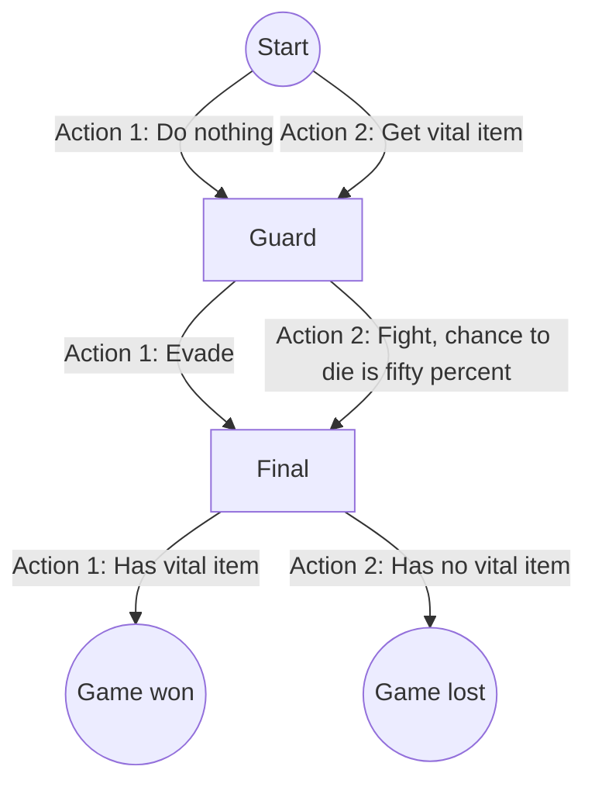

# mlpack_example_2

 * See ['relearn' example 1](https://github.com/richelbilderbeek/relearn_example_1)
   for the same problem using [the relearn library](https://github.com/alexge233/relearn)

[mlpack example](https://github.com/richelbilderbeek/mlpack_examples) 2: Q learning.

## Initial

State|Action 1|Action 2
-----|--------|--------
Start|1.0     |1.0
Guard|1.0     |1.0
Check|1.0     |1.0

## Final

State|Action 1|Action 2
-----|--------|--------
Start|0.0     |1.0
Guard|1.0     |0.5
Final|1.0     |0.0

