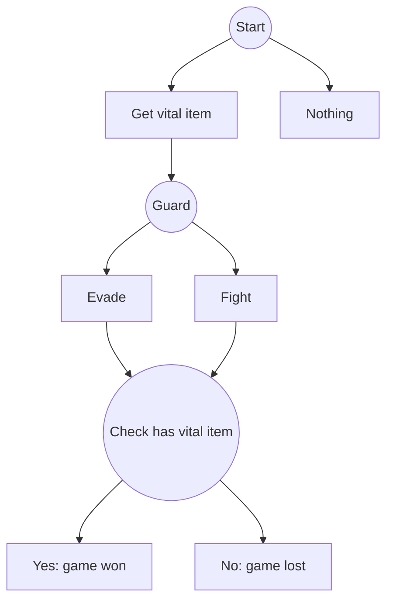

# mlplack_example_2

mlpack example 2: Q learning

```mermaid
graph TD;
    0((Start))-->10[Get vital item];
    0-->20[Nothing];
    10-->100((Guard));
    100-->110[Evade];
    100-->120[Fight];
    110-->200((Check has vital item));
    120-->200;
    200-->210[Yes: game won];
    200-->220[No: game lost];
```

